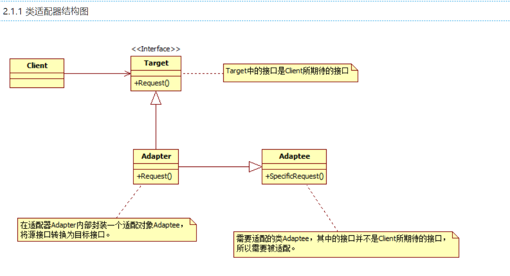
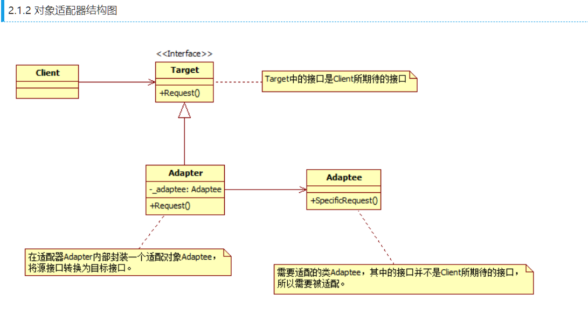

code reference
Java设计模式----适配器模式
https://blog.csdn.net/ymeng_bupt/article/details/6833480

图文详解 23 种设计模式
https://mp.weixin.qq.com/s/goit1Et8_MhF2zZXl9xuSg

适配器模式是一种结构型设计模式。适配器模式的思想是：
把一个类的接口变换成客户端所期待的另一种接口，
从而使原本因接口不匹配而无法在一起工作的两个类能够在一起工作。

用电器来打个比喻：有一个电器的插头是三脚的，而现有的插座是两孔的，
要使插头插上插座，我们需要一个插头转换器，这个转换器即是适配器。

适配器模式涉及3个角色：

源（Adaptee）：需要被适配的对象或类型，相当于插头。
适配器（Adapter）：连接目标和源的中间对象，相当于插头转换器。
目标（Target）：期待得到的目标，相当于插座。
适配器模式包括3种形式：类适配器模式、对象适配器模式、接口适配器模式（或又称作缺省适配器模式）。

类适配器结构图

对象适配器结构图

