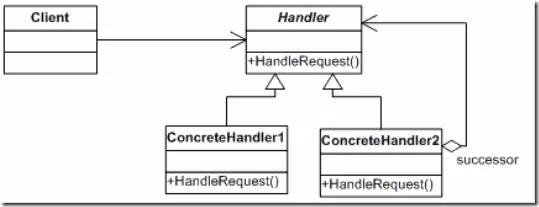

code reference
Java设计模式13：责任链模式
https://www.cnblogs.com/xrq730/p/10633761.html

图文详解 23 种设计模式
https://mp.weixin.qq.com/s/goit1Et8_MhF2zZXl9xuSg

责任链模式的分析
首先，责任链模式中，存在着这么几个角色：

Handler处理者
handler金额use定义了处理请求的接口，handler知道，下一个处理者是谁，如果自己无法处理请求，就转给下一个处理者。
在实例中对应的是，support类和support方法

concreteHandler(具体的处理者)
具体的处理者是处理请求的具体角色。
在此实例中，由NoSupport角色和其他几个类扮演

Client
请求者角色，就是向第一个具体的handler发送请求的角色，并连接好责任链，实例中对应的是main类的main方法。

责任链模式的类图如下：

作者：六尺帐篷
链接：https://www.jianshu.com/p/198a29556f30
来源：简书
著作权归作者所有。商业转载请联系作者获得授权，非商业转载请注明出处。