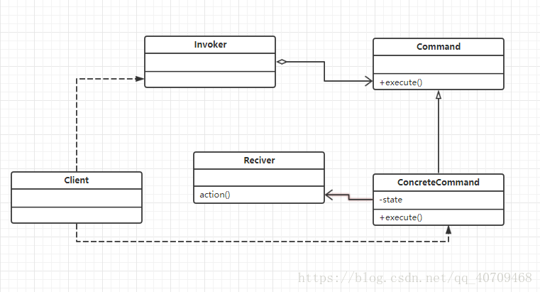

Code reference
Java设计模式之命令模式
https://blog.csdn.net/jason0539/article/details/45110355

1、命令模式的概念
命令模式；将一个请求封装为一个对象，从而可用不同的请求对客户进行参数化，对请求排队或者对请求做日志记录，以及可以支持撤销的操作。

简而言之：命令模式可以将请求发送者和接受者进行解耦。通过，命令模式创建命令对象。命令对象接受，发送者的请求，然后命令对象调用对应的接受者的方法！

2、命令模式的UML图及角色

Command(抽象命令者)：这个角色为接口或抽象类，其中生命的EXECUTE方法为调用请求接受者执行的方法。

ConcreteCommand(具体命令者):这个角色实现了抽象命令类的方法，也是具体接受者的关联的类。同过具体的execute方法调用处理类的方法处理请求。

Invoker（请求发送者）:具体的请求发送者，不需要再创建的时候具体指定谁来处理它。可以再运行时通过命令对象具体注入谁来处理这个请求。

Reciver(请求处理者)：执行与请求相关的业务代码。

4、命令模式的优点及缺点
优点：

命令模式可以解耦对应的发送者和接受者之间的联系。通过命令对象来进行接收者的调配。
可以容易的设计一个宏命令。
缺点:

     1、会可能出现很多个具体的命令类。造成系统的冗余。

5、命令模式使用场景
1、系统需要将请求调用者和请求接受者进行解耦，使得使用者和调用者互相解耦。请求调用者无需知道请求接受者的存在。

      2、系统需要再不同的时间指定请求，将请求排队执行。

      3、系统需要支持命令的撤销操作和恢复操作。

6、总结
命令模式还有其他应用场景，可以和组合模式相配合。可以和做成宏命令，不过这些，我还没切身体验，先留个概念。
命令模式是行为型的设计模式。

版权声明：本文为博主原创文章，遵循 CC 4.0 BY-SA 版权协议，转载请附上原文出处链接和本声明。

原文链接：https://blog.csdn.net/qq_40709468/article/details/82724371

