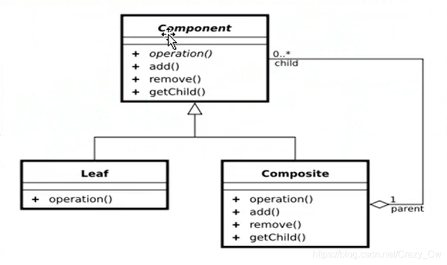
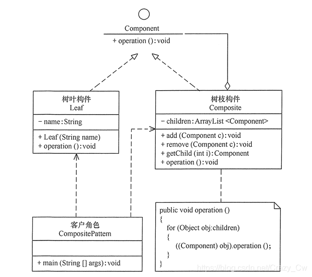

code reference
了解23种设计模式之组合模式
https://blog.csdn.net/Crazy_Cw/article/details/106910993/

组合模式的结构

组合模式的角色和职责

Component : (树形结构的节点抽象)

为所有的对象定义统一的接口，（公共属性，行为等的定义）
提供管理子节点对象的接口方法
（选择）提供管理父节点对象的接口方法
Leaf ： （树形结构的叶节点）

Composite： (树形结构的枝节点)

优点：

组合模式使得客户端代码可以一致地处理单个对象和组合对象，无须关心自己处理的是单个对象，还是组合对象，这简化了客户端代码；
更容易在组合体内加入新的对象，客户端不会因为加入了新的对象而更改源代码，满足“开闭原则”；
缺点：

设计较复杂，客户端需要花更多时间理清类之间的层次关系；
不容易限制容器中的构件；
不容易用继承的方法来增加构件的新功能；
组合模式分为透明式的组合模式和安全式的组合模式。

透明方式代码实现：

透明方式：在该方式中，由于抽象构件声明了所有子类中的全部方法，
所以客户端无须区别树叶对象和树枝对象，对客户端来说是透明的。
但其缺点是：树叶构件本来没有 Add()、Remove() 及 GetChild() 方法，却要实现它们（空实现或抛异常），
这样会带来一些安全性问题。

安全方式

安全方式：在该方式中，将管理子构件的方法移到树枝构件中，抽象构件和树叶构件没有对子对象的管理方法，
这样就避免了上一种方式的安全性问题，但由于叶子和分支有不同的接口，
客户端在调用时要知道树叶对象和树枝对象的存在，所以失去了透明性。

