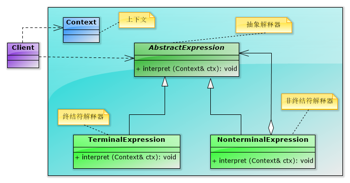
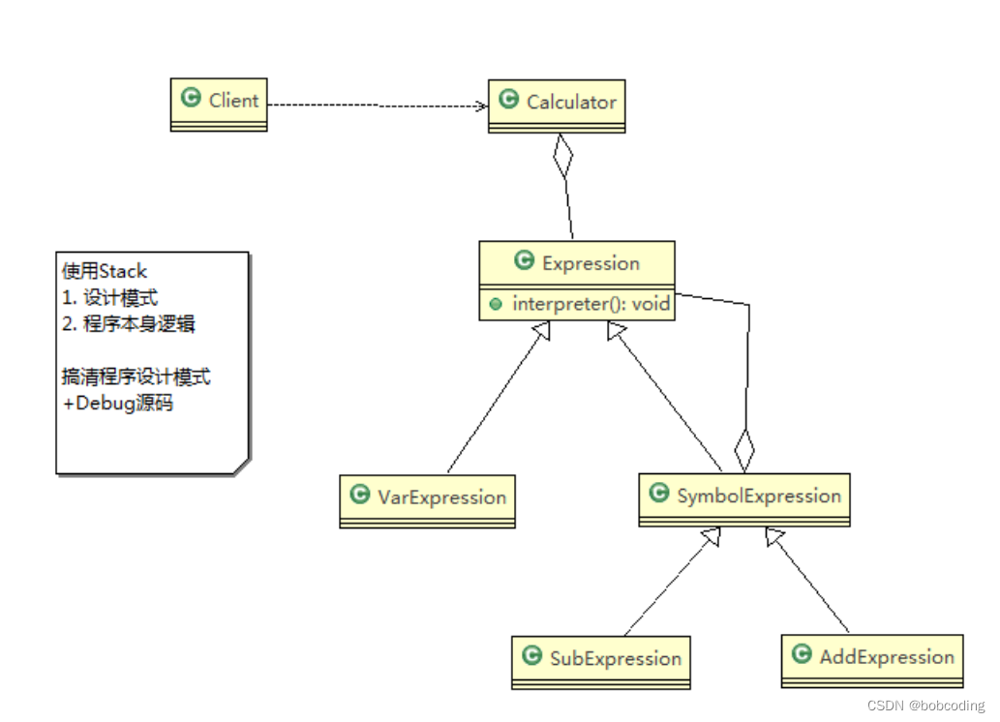

code reference
Java设计模式之解释器模式(UML类图分析+代码详解)
https://blog.csdn.net/m0_51750419/article/details/127477811

解释器模式（Interpreter Pattern）的定义

（1）定义

给定一个语言，定义它的文法的一种表示，并定义一个解释器，这个解释器使用该表示来解释语言中的句子。

①文法：即语法规则。在解释器模式中每一个语法都将对应一个解释器对象，用来处理相应的语法规则。它对于扩展、改变文法以及增加新的文法规则都很方便。

②解释器模式描述了如何为简单的语言定义一个文法，如何在该语言中表示一个句子，以及如何解释这些句子。

③在解释器模式中可以通过一种称之为抽象语法树(Abstract Syntax Tree, AST)的图形方式来直观地表示语言的构成，每一棵抽象语法树对应一个语言实例

（2）解释器模式的结构和说明

①AbstractExpression：定义解释器的接口，约定解释器的解释操作。其中的Interpret接口，正如其名字那样，它是专门用来解释该解释器所要实现的功能。（如加法解释器中的Interpret接口就是完成两个操作数的相加功能）。

②TerminalExpression：终结符解释器，用来实现语法规则中和终结符相关的操作，不再包含其他的解释器，如果用组合模式来构建抽象语法树的话，就相当于组合模式中的叶子对象，可以有多种终结符解释器。

③NonterminalExpression：非终结符解释器，用来实现语法规则中非终结符相关的操作，通常一个解释器对应一个语法规则，可以包含其他解释器，如果用组合模式构建抽象语法树的话，就相当于组合模式中的组合对象。可以有多种非终结符解释器。

④Context：上下文，通常包含各个解释器需要的数据或是公共的功能。这个Context在解释器模式中起着非常重要的作用。一般用来传递被所有解释器共享的数据，后面的解释器可以从这里获取这些值。

⑤Client：客户端，指的是使用解释器的客户端，通常在这里将按照语言的语法做的表达式转换成使用解释器对象描述的抽象语法树，然后调用解释操作。

解释器模式总结
解释器模式为自定义语言的设计和实现提供了一种解决方案，它用于定义一组文法规则并通过这组文法规则来解释语言中的句子。虽然解释器模式的使用频率不是特别高，但是它在正则表达式、XML文档解释等领域还是得到了广泛使用。

主要优点
易于改变和扩展文法。由于在解释器模式中使用类来表示语言的文法规则，因此可以通过继承等机制来改变或扩展文法。
每一条文法规则都可以表示为一个类，因此可以方便地实现一个简单的语言。
实现文法较为容易。在抽象语法树中每一个表达式节点类的实现方式都是相似的，这些类的代码编写都不会特别复杂，还可以通过一些工具自动生成节点类代码。
增加新的解释表达式较为方便。如果用户需要增加新的解释表达式只需要对应增加一个新的终结符表达式或非终结符表达式类，原有表达式类代码无须修改，符合 "开闭原则"。
主要缺点
对于复杂文法难以维护。在解释器模式中，每一条规则至少需要定义一个类，因此如果一个语言包含太多文法规则，类的个数将会急剧增加，导致系统难以管理和维护，此时可以考虑使用语法分析程序等方式来取代解释器模式。
执行效率较低。由于在解释器模式中使用了大量的循环和递归调用，因此在解释较为复杂的句子时其速度很慢，而且代码的调试过程也比较麻烦。
适用场景
可以将一个需要解释执行的语言中的句子表示为一个抽象语法树。
一些重复出现的问题可以用一种简单的语言来进行表达。
一个语言的文法较为简单。
对执行效率要求不高。

解释器模式来实现四则
1) 应用实例要求 通过解释器模式来实现四则运算， 如计算a+b-c的值

2) 思路分析和图解(类图)

