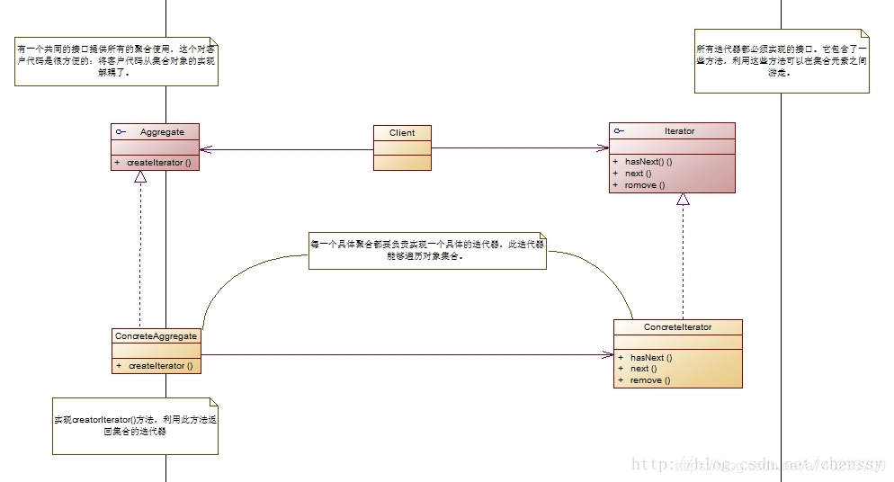
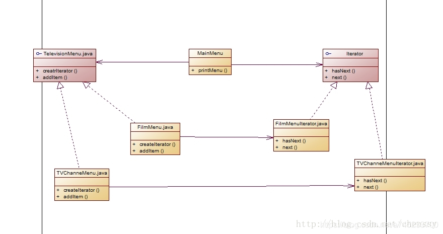

code reference

什么是迭代器模式：
实际开发中，我们针对不同的需求，可能需要以不同的方式来遍历整个整合对象，但我们不希望在集合容器的抽象接口层中充斥着各种不同的遍历操作，这时候我们就需要一种能完成下面功能的迭代器：

（1）遍历一个集合对象
（2）不需要了解聚合对象的内部结构
（3）提供多种不同的遍历方式
迭代器模式提供一种访问集合中的各个元素，而不暴露其内部表示的方法。将在元素之间游走的职责交给迭代器，而不是集合对象，从而简化集合容器的实现，让集合容器专注于在它所应该专注的事情上，更加符合单一职责原则。

二、UML结构图：

Iterator：抽象迭代器，提供了在集合容器元素之间游走的方法。
ConcreteIterator：具体迭代器，能够对具体的集合容器进行遍历，每种集合容器都应该对应一个具体的迭代器
Aggregate：抽象容器类
ConcreteAggregate：具体容器类，实现 creatorIterator() 方法，返回该聚合对象的迭代器。

代码实现：
你项目组接到一个项目：对电视机的电视频道、电影菜单进行统一管理，建立一个统一的菜单管理界面，能够看到所有的电视界面、电影界面。你有三个手下：小李子、小杏子，他们分别就每个模块做开发工作，看他们都做了哪些工作。项目的UML结构图：

