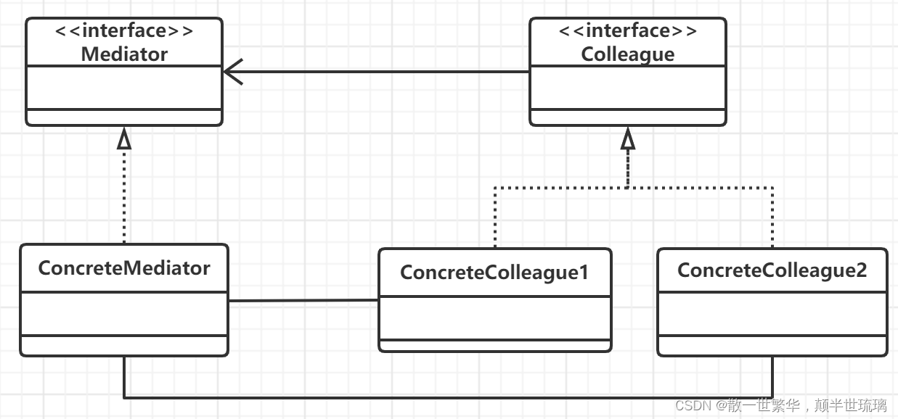

1.定义
中介者模式（Mediator Pattern）是用来降低多个对象和类之间的通信复杂性。这种模式提供了一个中介类，该类通常处理不同类之间的通信，并支持松耦合，使代码易于维护。中介者模式属于行为型模式。
简单来说：用一个中介对象来封装一系列的对象的交互。中介者使各对象不需要显示地相互引用，从而使其耦合松散，而且可以独立地改变它们之间的交互。

2.概述
一个对象含有另一个对象的引用是面向对象中经常使用的方式，也是面向对象锁提倡的，即少用继承多用组合。
但是，对于某些特殊系统，特别是涉及很多对象时，该系统可能不希望这些对象直接交互，即不希望这些对象之间互相包含对方的引用，其原因是不利于系统今后的维护，扩展以及对象的复用。

3.应用场景
1、系统中对象之间存在比较复杂的引用关系，导致它们之间的依赖关系结构混乱而且难以复用该对象。
2、想通过一个中间类来封装多个类中的行为，而又不想生成太多的子类。

4.模式的结构与使用
中介者模式的结构中包括四种角色
1.中介者（Mediator）：中介者是一个接口，该接口定义了用于同事（Colleague）对象之间进行通信的方法；
2.具体中介者（ConcreteMediator）：具体中介者是实现中介者接口的类。具体中介者需要包含所有具体同事（ConcreteColleague）的引用，并通过实现中介者接口中的方法来满足具体同事之间的通信要求；
3.同事（Colleague）：一个接口，规定了具体同事需要实现的方法；
4.具体同事（ConcreteColleague）：实现了同事接口的类。具体同事需要包含具体中介者的引用，一个具体同事需要和其他具体同事交互时，只需将自己的请求通知给它所包含的具体中介者的引用。

1.中介者模式的UML类图

————————————————
优缺点

减少了子类生成，Mediator将原本分布于多个对象间的行为集中在一起。改变这些行为只需生成Meditator的子类即可。这样各个Colleague类可被重用；
它将各Colleague解耦，Mediator有利于各Colleague间的松耦合。你可以独立的改变和复用各Colleague类和Mediator类；
它简化了对象协议，用Mediator和Colleague间的一对多的交互来代替多对多的交互。一对多的关系更容易理解、维护和扩展；
它对对象如何协作进行了抽象，将中介作为一个独立的概念并将其封装在一个对象中，使你将注意力从对象各自本身的行为转移到它们之间的交互上来。这有助于弄清楚一个系统中的对象是如何交互的；
它使控制集中化，中介者模式将交互的复杂性变为中介者的复杂性。因为中介者封装了协议，它可能变得比任一个Colleague都复杂。这可能使得中介者自身成为一个难于维护的庞然大物。
使用场合

在下列情况下使用中介者模式：

一组对象以定义良好但是复杂的方式进行通信。产生的相互依赖关系结构混乱且难以理解；
一个对象引用其他很多对象并且直接与这些对象通信，导致难以复用该对象；
想定制一个分布在多个类中的行为，而又不想生成太多的子类。
————————————————

                            版权声明：本文为博主原创文章，遵循 CC 4.0 BY-SA 版权协议，转载请附上原文出处链接和本声明。

原文链接：https://blog.csdn.net/qq_24649627/article/details/115486064
                            版权声明：本文为博主原创文章，遵循 CC 4.0 BY-SA 版权协议，转载请附上原文出处链接和本声明。

原文链接：https://blog.csdn.net/qq_51447436/article/details/124272944

