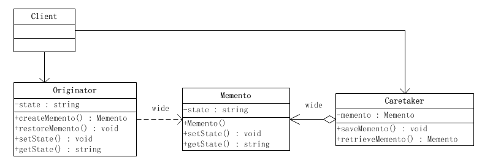
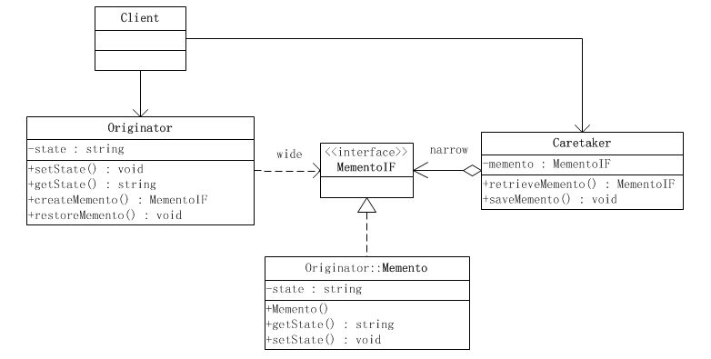
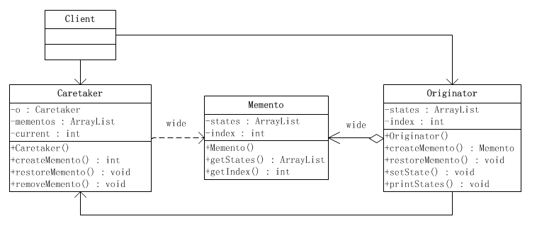
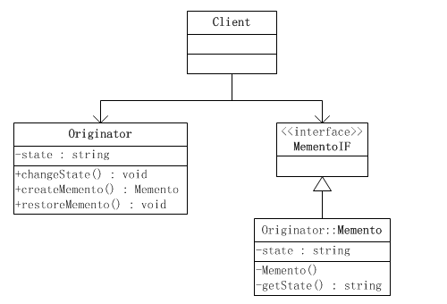

备忘录模式又叫做快照模式(Snapshot Pattern)或Token模式，是对象的行为模式。

备忘录对象是一个用来存储另外一个对象内部状态的快照的对象。备忘录模式的用意是在不破坏封装的条件下，将一个对象的状态捕捉(Capture)住，并外部化，存储起来，从而可以在将来合适的时候把这个对象还原到存储起来的状态。备忘录模式常常与命令模式和迭代子模式一同使用。

备忘录模式的结构
　　备忘录模式的结构图如下所示

　　

备忘录模式所涉及的角色有三个：备忘录(Memento)角色、发起人(Originator)角色、负责人(Caretaker)角色。

备忘录(Memento)角色
　　备忘录角色又如下责任：

（1）将发起人（Originator）对象的内战状态存储起来。备忘录可以根据发起人对象的判断来决定存储多少发起人（Originator）对象的内部状态。

（2）备忘录可以保护其内容不被发起人（Originator）对象之外的任何对象所读取。

备忘录有两个等效的接口：

●　　窄接口：负责人（Caretaker）对象（和其他除发起人对象之外的任何对象）看到的是备忘录的窄接口(narrow interface)，这个窄接口只允许它把备忘录对象传给其他的对象。

●　　宽接口：与负责人对象看到的窄接口相反的是，发起人对象可以看到一个宽接口(wide interface)，这个宽接口允许它读取所有的数据，以便根据这些数据恢复这个发起人对象的内部状态。

发起人（Originator）角色
　　发起人角色有如下责任：

（1）创建一个含有当前的内部状态的备忘录对象。

（2）使用备忘录对象存储其内部状态。

负责人（Caretaker）角色
　　负责人角色有如下责任：

（1）负责保存备忘录对象。

（2）不检查备忘录对象的内容。

“白箱”备忘录模式的实现
　　备忘录角色对任何对象都提供一个接口，即宽接口，备忘录角色的内部所存储的状态就对所有对象公开。因此这个实现又叫做“白箱实现”。

“白箱”实现将发起人角色的状态存储在一个大家都看得到的地方，因此是破坏封装性的。但是通过程序员自律，同样可以在一定程度上实现模式的大部分用意。因此白箱实现仍然是有意义的。

下面给出一个示意性的“白箱实现”。

黑箱”备忘录模式的实现
　　备忘录角色对发起人（Originator）角色对象提供一个宽接口，而为其他对象提供一个窄接口。这样的实现叫做“黑箱实现”。

在JAVA语言中，实现双重接口的办法就是将备忘录角色类设计成发起人角色类的内部成员类。

将Memento设成Originator类的内部类，从而将Memento对象封装在Originator里面；在外部提供一个标识接口MementoIF给Caretaker以及其他对象。这样，Originator类看到的是Menmento的所有接口，而Caretaker以及其他对象看到的仅仅是标识接口MementoIF所暴露出来的接口。

使用内部类实现备忘录模式的类图如下所示。

多重检查点
　　前面所给出的白箱和黑箱的示意性实现都是只存储一个状态的简单实现，也可以叫做只有一个检查点。常见的系统往往需要存储不止一个状态，而是需要存储多个状态，或者叫做有多个检查点。

备忘录模式可以将发起人对象的状态存储到备忘录对象里面，备忘录模式可以将发起人对象恢复到备忘录对象所存储的某一个检查点上。下面给出一个示意性的、有多重检查点的备忘录模式的实现。

“自述历史”模式
　　所谓“自述历史”模式(History-On-Self Pattern)实际上就是备忘录模式的一个变种。在备忘录模式中，发起人(Originator)角色、负责人(Caretaker)角色和备忘录(Memento)角色都是独立的角色。虽然在实现上备忘录类可以成为发起人类的内部成员类，但是备忘录类仍然保持作为一个角色的独立意义。在“自述历史”模式里面，发起人角色自己兼任负责人角色。

“自述历史”模式的类图如下所示：

备忘录角色有如下责任：

（1）将发起人（Originator）对象的内部状态存储起来。

（2）备忘录可以保护其内容不被发起人（Originator）对象之外的任何对象所读取。

发起人角色有如下责任：

（1）创建一个含有它当前的内部状态的备忘录对象。

（2）使用备忘录对象存储其内部状态。

客户端角色有负责保存备忘录对象的责任。

　　