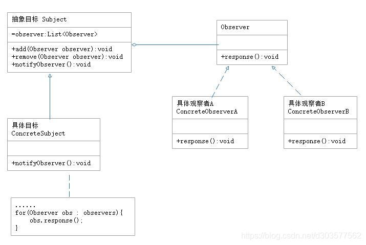
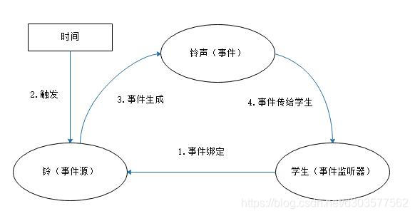
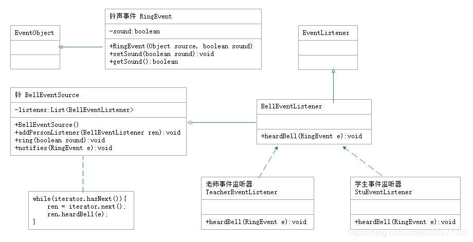

code reference
Java设计模式之观察者模式 https://blog.csdn.net/jason0539/article/details/45055233

定义
观察者（Observer）模式的定义：指多个对象间存在一对多的依赖关系，当一个对象的状态发生改变时，所有依赖于它的对象都得到通知并被自动更新。这种模式有时又称作发布-订阅、模型-视图模式，它是对象行为模式。

3.优点
降低了目标与观察者之间的耦合关系，两者之间都是抽象耦合关系。符合依赖倒置原则。
目标与观察者之间建立了一套触发机制。
4.缺点
目标与观察者之间的依赖关系并没有完全解除，而且有可能出现循环引用。
当观察者对象很多时，通知的发布会花费很多时间，影响程度的效率。
5.结构
实现观察者模式要注意具体目标对象和具体观察者之间不能直接调用，否则将使两者之间紧密耦合起来，这违反了面向对象的设计原则。
观察者模式的主要角色如下：

抽象主题（Subject）角色：也叫抽象目标类，它提供了一个用于保存观察者对象的聚集类和增加、删除观察者对象的方法，以及通知所有观察者的抽象方法。
具体主题（Concrete Subject）角色：也叫具体目标类，它实现抽象目标中的通知方法，当具体主题的内部状态发生改变时，通知所有注册过的观察者对象。
抽象观察者（Observer）角色：它是一个抽象类或接口，它包含了一个更新自己的抽象方法，当接到具体主题的更改通知时被调用。
具体观察者（Concrete Observer）角色：实现抽象观察者中定义的抽象方法，以便在得到目标的更改通知时更新自身的状态。
结构图如下：

应用实例
例：利用观察者模式设计一个学校铃声的时间处理程序。
分析：在本实例中，学校的“铃”是事件源和目标，“老师”和“学生”是事件监听器和具体观察者，“铃声”是事件类。学生和老师来到学校的教学区，都会注意学校的铃，这叫事件绑定；当上课时间或下课时间到，都会触发铃声响，这时会生成“铃声”时间；学生和老师听到铃声会开始上课或下课，这叫事件处理。这个实例非常适合用观察者模式实现。
事件模型图如下：

现在用“观察者模式”来实现该事件处理模型。
首先，定义一个铃声事件（RingEvent）类，它记录了铃声的类型（上课铃声/下课铃声）。
再定义一个学校的铃（BellEventSource）类，它是事件源，是观察者目标类，该类里面包含了监听器容器listener，可以绑定监听者（学生或老师），并且有产生铃声事件和通知所有监听者的方法。
然后，定义铃声事件监听者（BellEventListener）类，它是抽象观察者，它包含了铃声事件处理方法heardBell(RingEvent e)。
最后，定义老师类（TeachEventListener）和学生类（StuEventListener），它们是时间监听器，是具体观察者，听到铃声会去上课或下课。
结构图如下：

