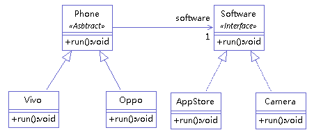
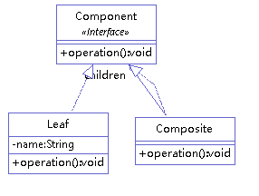
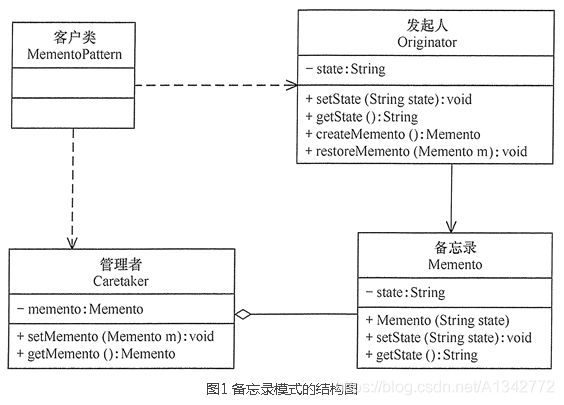

23 种设计模式详解（全23种）
https://blog.csdn.net/A1342772/article/details/91349142

总体来说设计模式分为三大类：

创建型模式，共五种：工厂方法模式、抽象工厂模式、单例模式、建造者模式、原型模式。

结构型模式，共七种：适配器模式、装饰器模式、代理模式、外观模式、桥接模式、组合模式、享元模式。

行为型模式，共十一种：策略模式、模板方法模式、观察者模式、迭代子模式、责任链模式、命令模式、备忘录模式、状态模式、访问者模式、中介者模式、解释器模式。

————————————————————————————————————————————————————————————————
    ———————————————— 简单工厂模式  ————————————————
————————————————————————————————————————————————————————————————

定义：定义了一个创建对象的类，由这个类来封装实例化对象的行为。

举例：（我们举一个pizza工厂的例子）
pizza工厂一共生产三种类型的pizza：chesse,pepper,greak。
通过工厂类（SimplePizzaFactory）实例化这三种类型的对象。类图如下：

简单工厂存在的问题与解决方法： 简单工厂模式有一个问题就是，类的创建依赖工厂类，也就是说，
如果想要拓展程序，必须对工厂类进行修改，这违背了开闭原则，所以，从设计角度考虑，有一定的问题，
如何解决？我们可以定义一个创建对象的抽象方法并创建多个不同的工厂类实现该抽象方法，
这样一旦需要增加新的功能，直接增加新的工厂类就可以了，不需要修改之前的代码。
这种方法也就是我们接下来要说的工厂方法模式。

优缺点：
简单工厂存在的问题与解决方法： 
简单工厂模式有一个问题就是，类的创建依赖工厂类，也就是说，如果想要拓展程序，必须对工厂类进行修改，
这违背了开闭原则，所以，从设计角度考虑，有一定的问题，如何解决？我们可以定义一个创建对象的抽象方法
并创建多个不同的工厂类实现该抽象方法，这样一旦需要增加新的功能，直接增加新的工厂类就可以了，
不需要修改之前的代码。这种方法也就是我们接下来要说的工厂方法模式。

————————————————————————————————————————————————————————————————
————————————————  工厂方法模式  ————————————————
————————————————————————————————————————————————————————————————
定义：定义了一个创建对象的抽象方法，由子类决定要实例化的类。工厂方法模式将对象的实例化推迟到子类。

举例：（我们依然举pizza工厂的例子，不过这个例子中，pizza产地有两个：伦敦和纽约）。
添加了一个新的产地，如果用简单工厂模式的的话，我们要去修改工厂代码，并且会增加一堆的if else语句。
而工厂方法模式克服了简单工厂要修改代码的缺点，它会直接创建两个工厂，纽约工厂和伦敦工厂。类图如下：

优缺点：
工厂方法存在的问题与解决方法：客户端需要创建类的具体的实例。简单来说就是用户要订纽约工厂的披萨，
他必须去纽约工厂，想订伦敦工厂的披萨，必须去伦敦工厂。 当伦敦工厂和纽约工厂发生变化了，
用户也要跟着变化，这无疑就增加了用户的操作复杂性。为了解决这一问题，我们可以把工厂类抽象为接口，
用户只需要去找默认的工厂提出自己的需求（传入参数），便能得到自己想要产品，
而不用根据产品去寻找不同的工厂，方便用户操作。这也就是我们接下来要说的抽象工厂模式。

————————————————————————————————————————————————————————————————
————————————————  抽象工厂模式 ————————————————
————————————————————————————————————————————————————————————————

定义：定义了一个接口用于创建相关或有依赖关系的对象族，而无需明确指定具体类。

举例：（我们依然举pizza工厂的例子，pizza工厂有两个：纽约工厂和伦敦工厂）。类图如下：

工厂模式适用的场合
大量的产品需要创建，并且这些产品具有共同的接口 。

1.5  三种工厂模式的使用选择
简单工厂 ： 用来生产同一等级结构中的任意产品。（不支持拓展增加产品）

工厂方法 ：用来生产同一等级结构中的固定产品。（支持拓展增加产品）

抽象工厂 ：用来生产不同产品族的全部产品。（支持拓展增加产品；支持增加产品族）

简单工厂的适用场合：只有伦敦工厂（只有这一个等级），并且这个工厂只生产三种类型的pizza：chesse,
pepper,greak（固定产品）。

工厂方法的适用场合：现在不光有伦敦工厂，还增设了纽约工厂（仍然是同一等级结构，但是支持了产品的拓展），
这两个工厂依然只生产三种类型的pizza：
chesse,pepper,greak（固定产品）。

抽象工厂的适用场合：不光增设了纽约工厂（仍然是同一等级结构，但是支持了产品的拓展），
这两个工厂还增加了一种新的类型的pizza：chinese pizza（增加产品族）。

所以说抽象工厂就像工厂，而工厂方法则像是工厂的一种产品生产线。因此，我们可以用抽象工厂模式创建工厂，
而用工厂方法模式创建生产线。比如，我们可以使用抽象工厂模式创建伦敦工厂和纽约工厂，
使用工厂方法实现cheese pizza和greak pizza的生产。类图如下：     

总结一下三种模式：

简单工厂模式就是建立一个实例化对象的类，在该类中对多个对象实例化。工厂方法模式是定义了一个创建对象
的抽象方法，由子类决定要实例化的类。这样做的好处是再有新的类型的对象需要实例化只要增加子类即可。
抽象工厂模式定义了一个接口用于创建对象族，而无需明确指定具体类。抽象工厂也是把对象的实例化交给了子类，
即支持拓展。同时提供给客户端接口，避免了用户直接操作子类工厂。

————————————————————————————————————————————————————————————————
————————————————  单例模式 ————————————————
————————————————————————————————————————————————————————————————
定义：确保一个类最多只有一个实例，并提供一个全局访问点

单例模式可以分为两种：预加载和懒加载
预加载
顾名思义，就是预先加载。再进一步解释就是还没有使用该单例对象，但是，该单例对象就已经被加载到内存了。
很明显，没有使用该单例对象，该对象就被加载到了内存，会造成内存的浪费。

懒加载
为了避免内存的浪费，我们可以采用懒加载，即用到该单例对象的时候再创建。
单例模式和线程安全
（1）预加载只有一条语句return instance,这显然可以保证线程安全。但是，我们知道预加载会造成内存的浪费。

（2）懒加载不浪费内存，但是无法保证线程的安全。首先，if判断以及其内存执行代码是非原子性的。其次，new Singleton()无法保证执行的顺序性。

不满足原子性或者顺序性，线程肯定是不安全的，这是基本的常识，不再赘述。我主要讲一下为什么new Singleton()无法保证顺序性。我们知道创建一个对象分三步:

memory=allocate();//1:初始化内存空间

ctorInstance(memory);//2:初始化对象

instance=memory();//3:设置instance指向刚分配的内存地址
jvm为了提高程序执行性能，会对没有依赖关系的代码进行重排序，上面2和3行代码可能被重新排序。我们用两个线程来说明线程是不安全的。线程A和线程B都创建对象。其中，A2和A3的重排序，将导致线程B在B1处判断出instance不为空，线程B接下来将访问instance引用的对象。此时，线程B将会访问到一个还未初始化的对象（线程不安全）。

————————————————————————————————————————————————————————————————
————————————————  建造者模式 ————————————————
————————————————————————————————————————————————————————————————

定义：封装一个复杂对象构造过程，并允许按步骤构造。

定义解释： 我们可以将生成器模式理解为，假设我们有一个对象需要建立，这个对象是由多个组件（Component）组合而成，每个组件的建立都比较复杂，但运用组件来建立所需的对象非常简单，所以我们就可以将构建复杂组件的步骤与运用组件构建对象分离，使用builder模式可以建立。

3.1 模式的结构和代码示例
生成器模式结构中包括四种角色：

（1）产品(Product)：具体生产器要构造的复杂对象；

（2）抽象生成器(Bulider)：抽象生成器是一个接口，该接口除了为创建一个Product对象的各个组件定义了若干个方法之外，
还要定义返回Product对象的方法（定义构造步骤）；

（3）具体生产器(ConcreteBuilder)：实现Builder接口的类，具体生成器将实现Builder接口所定义的方法（生产各个组件）；

（4）指挥者(Director)：指挥者是一个类，该类需要含有Builder接口声明的变量。指挥者的职责是负责向用户提供具体生成器，
即指挥者将请求具体生成器类来构造用户所需要的Product对象，如果所请求的具体生成器成功地构造出Product对象，指挥者就可以让该具体生产器返回所构造的Product对象。（按照步骤组装部件，并返回Product）

生成器模式的优缺点
优点
将一个对象分解为各个组件

将对象组件的构造封装起来

可以控制整个对象的生成过程

缺点
对不同类型的对象需要实现不同的具体构造器的类，这可能回答大大增加类的数量

3.3 生成器模式与工厂模式的不同
生成器模式构建对象的时候，对象通常构建的过程中需要多个步骤，就像我们例子中的先有主机，再有显示屏，再有鼠标等等，
生成器模式的作用就是将这些复杂的构建过程封装起来。工厂模式构建对象的时候通常就只有一个步骤，调用一个工厂方法
就可以生成一个对象。

————————————————————————————————————————————————————————————————
————————————————  原型模式 ————————————————
————————————————————————————————————————————————————————————————

定义：通过复制现有实例来创建新的实例，无需知道相应类的信息。

简单地理解，其实就是当需要创建一个指定的对象时，我们刚好有一个这样的对象，但是又不能直接使用，我会clone一个一毛一样的新对象来使用；基本上这就是原型模式。关键字：Clone。

4.1 深拷贝和浅拷贝
浅复制：将一个对象复制后，基本数据类型的变量都会重新创建，而引用类型，指向的还是原对象所指向的。

深复制：将一个对象复制后，不论是基本数据类型还有引用类型，都是重新创建的。简单来说，就是深复制进行了完全彻底的复制，
而浅复制不彻底。clone明显是深复制， clone出来的对象是是不能去影响原型对象的

4.2 原型模式的结构和代码示例

Client：使用者

Prototype：接口（抽象类），声明具备clone能力，例如java中得Cloneable接口

ConcretePrototype：具体的原型类

可以看出设计模式还是比较简单的，重点在于Prototype接口和Prototype接口的实现类ConcretePrototype。
原型模式的具体实现：一个原型类，只需要实现Cloneable接口，覆写clone方法，此处clone方法可以改成任意的名称，
因为Cloneable接口是个空接口，你可以任意定义实现类的方法名，如cloneA或者cloneB，因为此处的重点是super.clone()这句话，
super.clone()调用的是Object的clone()方法。

优缺点：
原型模式的本质就是clone，可以解决构建复杂对象的资源消耗问题，能再某些场景中提升构建对象的效率；
还有一个重要的用途就是保护性拷贝，可以通过返回一个拷贝对象的形式，实现只读的限制。

————————————————————————————————————————————————————————————————
————————————————  适配器模式 ————————————————
————————————————————————————————————————————————————————————————
定义： 适配器模式将某个类的接口转换成客户端期望的另一个接口表示，目的是消除由于接口不匹配所造成的类的兼容性问题。

主要分为三类：类的适配器模式、对象的适配器模式、接口的适配器模式。

5.1 类适配器模式
通过多重继承目标接口和被适配者类方式来实现适配

举例(将USB接口转为VGA接口)，类图如下：

对象适配器模式
对象适配器和类适配器使用了不同的方法实现适配，对象适配器使用组合，类适配器使用继承。

举例(将USB接口转为VGA接口)，类图如下：

接口适配器模式
当不需要全部实现接口提供的方法时，可先设计一个抽象类实现接口，并为该接口中每个方法提供一个默认实现（空方法），
那么该抽象类的子类可有选择地覆盖父类的某些方法来实现需求，它适用于一个接口不想使用其所有的方法的情况。

举例(将USB接口转为VGA接口，VGA中的b()和c()不会被实现)，类图如下：

优缺点：
类适配器模式：当希望将一个类转换成满足另一个新接口的类时，可以使用类的适配器模式，创建一个新类，继承原有的类，
实现新的接口即可。

对象适配器模式：当希望将一个对象转换成满足另一个新接口的对象时，可以创建一个Wrapper类，持有原类的一个实例，
在Wrapper类的方法中，调用实例的方法就行。

接口适配器模式：当不希望实现一个接口中所有的方法时，可以创建一个抽象类Wrapper，实现所有方法，我们写别的类的时候，
继承抽象类即可。

命名规则：
我个人理解，三种命名方式，是根据 src是以怎样的形式给到Adapter（在Adapter里的形式）来命名的。
类适配器，以类给到，在Adapter里，就是将src当做类，继承，
对象适配器，以对象给到，在Adapter里，将src作为一个对象，持有。
接口适配器，以接口给到，在Adapter里，将src作为一个接口，实现。

使用选择：
根据合成复用原则，组合大于继承。因此，类的适配器模式应该少用。

————————————————————————————————————————————————————————————————
————————————————  装饰者模式 ————————————————
————————————————————————————————————————————————————————————————
定义：动态的将新功能附加到对象上。在对象功能扩展方面，它比继承更有弹性。

6.1 装饰者模式结构图与代码示例
1.Component（被装饰对象的基类）

定义一个对象接口，可以给这些对象动态地添加职责。

2.ConcreteComponent（具体被装饰对象）

定义一个对象，可以给这个对象添加一些职责。

3.Decorator（装饰者抽象类）

维持一个指向Component实例的引用，并定义一个与Component接口一致的接口。

4.ConcreteDecorator（具体装饰者）

具体的装饰对象，给内部持有的具体被装饰对象，增加具体的职责。

被装饰对象和修饰者继承自同一个超类
————————————————

优缺点：
装饰者和被装饰者之间必须是一样的类型,也就是要有共同的超类。在这里应用继承并不是实现方法的复制,而是实现类型的匹配。
因为装饰者和被装饰者是同一个类型,因此装饰者可以取代被装饰者,这样就使被装饰者拥有了装饰者独有的行为。根据装饰者模式
的理念,我们可以在任何时候,实现新的装饰者增加新的行为。如果是用继承,每当需要增加新的行为时,就要修改原程序了。

————————————————————————————————————————————————————————————————
————————————————  代理模式 ————————————————
————————————————————————————————————————————————————————————————

定义：代理模式给某一个对象提供一个代理对象，并由代理对象控制对原对象的引用。通俗的来讲代理模式就是我们生活中常见的
中介。

举个例子来说明：假如说我现在想买一辆二手车，虽然我可以自己去找车源，做质量检测等一系列的车辆过户流程，
但是这确实太浪费我得时间和精力了。我只是想买一辆车而已为什么我还要额外做这么多事呢？于是我就通过中介公司来买车，
他们来给我找车源，帮我办理车辆过户流程，我只是负责选择自己喜欢的车，然后付钱就可以了。用图表示如下：

为什么要用代理模式？
中介隔离作用：在某些情况下，一个客户类不想或者不能直接引用一个委托对象，而代理类对象可以在客户类和委托对象之间
起到中介的作用，其特征是代理类和委托类实现相同的接口。

开闭原则，增加功能：代理类除了是客户类和委托类的中介之外，我们还可以通过给代理类增加额外的功能来扩展委托类的功能，
这样做我们只需要修改代理类而不需要再修改委托类，符合代码设计的开闭原则。代理类主要负责为委托类预处理消息、过滤消息、
把消息转发给委托类，以及事后对返回结果的处理等。代理类本身并不真正实现服务，而是同过调用委托类的相关方法，
来提供特定的服务。真正的业务功能还是由委托类来实现，但是可以在业务功能执行的前后加入一些公共的服务。
例如我们想给项目加入缓存、日志这些功能，我们就可以使用代理类来完成，而没必要打开已经封装好的委托类。

代理模式分为三类：1. 静态代理 2. 动态代理 3. CGLIB代理
静态代理

举例(买房），类图如下：

优点：可以做到在符合开闭原则的情况下对目标对象进行功能扩展。

缺点： 代理对象与目标对象要实现相同的接口，我们得为每一个服务都得创建代理类，工作量太大，不易管理。
同时接口一旦发生改变，代理类也得相应修改。

动态代理
动态代理有以下特点:

1.代理对象,不需要实现接口

2.代理对象的生成,是利用JDK的API,动态的在内存中构建代理对象(需要我们指定创建代理对象/目标对象实现的接口的类型)

代理类不用再实现接口了。但是，要求被代理对象必须有接口。

动态代理实现：
Java.lang.reflect.Proxy类可以直接生成一个代理对象
Proxy.newProxyInstance(ClassLoader loader, Class<?>[] interfaces, InvocationHandler h)生成一个代理对象
参数1:ClassLoader loader 代理对象的类加载器 一般使用被代理对象的类加载器
参数2:Class<?>[] interfaces 代理对象的要实现的接口 一般使用的被代理对象实现的接口
参数3:InvocationHandler h (接口)执行处理类

InvocationHandler中的invoke(Object proxy, Method method, Object[] args)方法：调用代理类的任何方法，此方法都会执行
参数3.1:代理对象(慎用)
参数3.2:当前执行的方法
参数3.3:当前执行的方法运行时传递过来的参数
动态代理总结：虽然相对于静态代理，动态代理大大减少了我们的开发任务，同时减少了对业务接口的依赖，降低了耦合度。
但是还是有一点点小小的遗憾之处，那就是它始终无法摆脱仅支持interface代理的桎梏（我们要使用被代理的对象的接口），
因为它的设计注定了这个遗憾。

CGLIB代理

CGLIB 原理：动态生成一个要代理类的子类，子类重写要代理的类的所有不是final的方法。在子类中采用方法拦截的技术
拦截所有父类方法的调用，顺势织入横切逻辑。它比使用java反射的JDK动态代理要快。

CGLIB 底层：使用字节码处理框架ASM，来转换字节码并生成新的类。不鼓励直接使用ASM，因为它要求你必须对JVM内部结构
包括class文件的格式和指令集都很熟悉。

CGLIB缺点：对于final方法，无法进行代理。
参数：Object为由CGLib动态生成的代理类实例，Method为上文中实体类所调用的被代理的方法引用，Object[]为参数值列表，
MethodProxy为生成的代理类对方法的代理引用。

返回：从代理实例的方法调用返回的值。

其中，proxy.invokeSuper(obj,arg) 调用代理类实例上的proxy方法的父类方法（即实体类TargetObject中对应的方法）
这里Enhancer类是CGLib中的一个字节码增强器，它可以方便的对你想要处理的类进行扩展，以后会经常看到它。

首先将被代理类TargetObject设置成父类，然后设置拦截器TargetInterceptor，最后执行enhancer.create()动态
生成一个代理类，并从Object强制转型成父类型TargetObject。
CGLIB代理总结： CGLIB创建的动态代理对象比JDK创建的动态代理对象的性能更高，但是CGLIB创建代理对象时所花费的时间却比JDK多得多。所以对于单例的对象，因为无需频繁创建对象，用CGLIB合适，反之使用JDK方式要更为合适一些。同时由于CGLib由于是采用动态创建子类的方法，对于final修饰的方法无法进行代理。

————————————————————————————————————————————————————————————————
            ————————————————  外观模式 ————————————————
————————————————————————————————————————————————————————————————

定义： 隐藏了系统的复杂性，并向客户端提供了一个可以访问系统的接口。

8.1 模式结构和代码示例

简单来说，该模式就是把一些复杂的流程封装成一个接口供给外部用户更简单的使用。这个模式中，设计到3个角色。

1）.门面角色：外观模式的核心。它被客户角色调用，它熟悉子系统的功能。内部根据客户角色的需求预定了几种功能的组合。
（客户调用，同时自身调用子系统功能）

2）.子系统角色:实现了子系统的功能。它对客户角色和Facade时未知的。它内部可以有系统内的相互交互，也可以由供外界
调用的接口。（实现具体功能）

3）.客户角色:通过调用Facede来完成要实现的功能（调用门面角色）。

举例（每个Computer都有CPU、Memory、Disk。在Computer开启和关闭的时候，相应的部件也会开启和关闭），类图如下：

优缺点：
优点
　　- 松散耦合

使得客户端和子系统之间解耦，让子系统内部的模块功能更容易扩展和维护；

- 简单易用

客户端根本不需要知道子系统内部的实现，或者根本不需要知道子系统内部的构成，它只需要跟Facade类交互即可。

- 更好的划分访问层次

有些方法是对系统外的，有些方法是系统内部相互交互的使用的。子系统把那些暴露给外部的功能集中到门面中，
这样就可以实现客户端的使用，很好的隐藏了子系统内部的细节。

————————————————————————————————————————————————————————————————
            ————————————————  桥接模式 ————————————————
————————————————————————————————————————————————————————————————
定义： 将抽象部分与它的实现部分分离，使它们都可以独立地变化。

9.1 案例
看下图手机与手机软件的类图

增加一款新的手机软件，需要在所有手机品牌类下添加对应的手机软件类，当手机软件种类较多时，将导致类的个数急剧膨胀，
难以维护

手机和手机中的软件是什么关系？

手机中的软件从本质上来说并不是一种手机，手机软件运行在手机中，是一种包含与被包含关系，而不是一种父与子或者说一般
与特殊的关系，通过继承手机类实现手机软件类的设计是违反一般规律的。

如果Oppo手机实现了wifi功能，继承它的Oppo应用商城也会继承wifi功能，并且Oppo手机类的任何变动，都会影响其子类

换一种解决思路

从类图上看起来更像是手机软件类图，涉及到手机本身相关的功能，比如说：wifi功能，放到哪个类中实现呢？放到OppoAppStore中
实现显然是不合适的

引起整个结构变化的元素有两个，一个是手机品牌，一个是手机软件，所以我们将这两个点抽出来，分别进行封装

桥接模式结构和代码示例

类图：

适用场景
桥接模式通常适用于以下场景。

当一个类存在两个独立变化的维度，且这两个维度都需要进行扩展时。

当一个系统不希望使用继承或因为多层次继承导致系统类的个数急剧增加时。

当一个系统需要在构件的抽象化角色和具体化角色之间增加更多的灵活性时。

9.4 优缺点
优点：

(1)在很多情况下，桥接模式可以取代多层继承方案，多层继承方案违背了“单一职责原则”，复用性较差，且类的个数非常多，
桥接模式是比多层继承方案更好的解决方法，它极大减少了子类的个数。

(2)桥接模式提高了系统的可扩展性，在两个变化维度中任意扩展一个维度，都不需要修改原有系统，符合“开闭原则”。

缺点：

桥接模式的使用会增加系统的理解与设计难度，由于关联关系建立在抽象层，要求开发者一开始就针对抽象层进行设计与编程。

————————————————————————————————————————————————————————————————
        ————————————————  组合模式 ————————————————
————————————————————————————————————————————————————————————————
定义：有时又叫作部分-整体模式，它是一种将对象组合成树状的层次结构的模式，用来表示“部分-整体”的关系，使用户对单个
对象和组合对象具有一致的访问性。

意图：将对象组合成树形结构以表示"部分-整体"的层次结构。组合模式使得用户对单个对象和组合对象的使用具有一致性。

主要解决：它在我们树型结构的问题中，模糊了简单元素和复杂元素的概念，客户程序可以向处理简单元素一样来处理复杂元素，
从而使得客户程序与复杂元素的内部结构解耦。

何时使用： 1、您想表示对象的部分-整体层次结构（树形结构）。 2、您希望用户忽略组合对象与单个对象的不同，
用户将统一地使用组合结构中的所有对象。

如何解决：树枝和叶子实现统一接口，树枝内部组合该接口。

关键代码：树枝内部组合该接口，并且含有内部属性 List，里面放 Component。

组合模式的主要优点有：

组合模式使得客户端代码可以一致地处理单个对象和组合对象，无须关心自己处理的是单个对象，还是组合对象，
这简化了客户端代码；

更容易在组合体内加入新的对象，客户端不会因为加入了新的对象而更改源代码，满足“开闭原则”；

其主要缺点是：

设计较复杂，客户端需要花更多时间理清类之间的层次关系；

不容易限制容器中的构件；

不容易用继承的方法来增加构件的新功能；
模式结构和代码示例

抽象构件（Component）角色：它的主要作用是为树叶构件和树枝构件声明公共接口，并实现它们的默认行为。在透明式的组合模式中抽象构件还声明访问和管理子类的接口；在安全式的组合模式中不声明访问和管理子类的接口，管理工作由树枝构件完成。

树叶构件（Leaf）角色：是组合中的叶节点对象，它没有子节点，用于实现抽象构件角色中 声明的公共接口。

树枝构件（Composite）角色：是组合中的分支节点对象，它有子节点。它实现了抽象构件角色中声明的接口，它的主要作用是存储和管理子部件，通常包含 Add()、Remove()、GetChild() 等方法

举例（访问一颗树），类图如下：

————————————————————————————————————————————————————————————————
————————————————  享元模式 ————————————————
————————————————————————————————————————————————————————————————

定义：通过共享的方式高效的支持大量细粒度的对象。

主要解决：在有大量对象时，有可能会造成内存溢出，我们把其中共同的部分抽象出来，如果有相同的业务请求，
直接返回在内存中已有的对象，避免重新创建。

何时使用： 1、系统中有大量对象。 2、这些对象消耗大量内存。 3、这些对象的状态大部分可以外部化。 
4、这些对象可以按照内蕴状态分为很多组，当把外蕴对象从对象中剔除出来时，每一组对象都可以用一个对象来代替。 
5、系统不依赖于这些对象身份，这些对象是不可分辨的。

如何解决：用唯一标识码判断，如果在内存中有，则返回这个唯一标识码所标识的对象。

关键代码：用 HashMap 存储这些对象。

应用实例： 1、JAVA 中的 String，如果有则返回，如果没有则创建一个字符串保存在字符串缓存池里面。

优点：大大减少对象的创建，降低系统的内存，使效率提高。

缺点：提高了系统的复杂度，需要分离出外部状态和内部状态，而且外部状态具有固有化的性质，不应该随着内部状态的变化
而变化，否则会造成系统的混乱。

简单来说，我们抽取出一个对象的外部状态（不能共享）和内部状态（可以共享）。然后根据外部状态的决定是否创建内部状态
对象。内部状态对象是通过哈希表保存的，当外部状态相同的时候，不再重复的创建内部状态对象，从而减少要创建对象的数量。

11.1 享元模式的结构图和代码示例

1、Flyweight (享元抽象类)：一般是接口或者抽象类，定义了享元类的公共方法。这些方法可以分享内部状态的数据，也可以调用这些方法修改外部状态。

2、ConcreteFlyweight(具体享元类)：具体享元类实现了抽象享元类的方法，为享元对象开辟了内存空间来保存享元对象的内部数据，同时可以通过和单例模式结合只创建一个享元对象。

3、FlyweightFactory(享元工厂类)：享元工厂类创建并且管理享元类，享元工厂类针对享元类来进行编程，通过提供一个享元池来进行享元对象的管理。一般享元池设计成键值对，或者其他的存储结构来存储。当客户端进行享元对象的请求时，如果享元池中有对应的享元对象则直接返回对应的对象，否则工厂类创建对应的享元对象并保存到享元池。

举例（JAVA 中的 String，如果有则返回，如果没有则创建一个字符串保存在字符串缓存池里面）。类图如下：

————————————————————————————————————————————————————————————————
————————————————  策略模式 ————————————————
————————————————————————————————————————————————————————————————
定义： 策略模式定义了一系列算法，并将每个算法封装起来，使他们可以相互替换，且算法的变化不会影响到使用算法的客户。

意图：定义一系列的算法,把它们一个个封装起来, 并且使它们可相互替换。

主要解决：在有多种算法相似的情况下，使用 if...else 所带来的复杂和难以维护。

何时使用：一个系统有许多许多类，而区分它们的只是他们直接的行为。

如何解决：将这些算法封装成一个一个的类，任意地替换。

关键代码：实现同一个接口。

12.1 策略模式结构和示例代码

抽象策略角色: 这个是一个抽象的角色，通常情况下使用接口或者抽象类去实现。对比来说，就是我们的Comparator接口。

具体策略角色: 包装了具体的算法和行为。对比来说，就是实现了Comparator接口的实现一组实现类。

环境角色: 内部会持有一个抽象角色的引用，给客户端调用。

举例如下（ 实现一个加减的功能），类图如下

优缺点：
优点： 1、算法可以自由切换。 2、避免使用多重条件判断。 3、扩展性良好。

缺点： 1、策略类会增多。 2、所有策略类都需要对外暴露。

————————————————————————————————————————————————————————————————
————————————————   模板模式 ————————————————
————————————————————————————————————————————————————————————————
定义：定义一个操作中算法的骨架，而将一些步骤延迟到子类中，模板方法使得子类可以不改变算法的结构即可重定义
该算法的某些特定步骤。

通俗点的理解就是 ：完成一件事情，有固定的数个步骤，但是每个步骤根据对象的不同，而实现细节不同；就可以在父类中
定义一个完成该事情的总方法，
按照完成事件需要的步骤去调用其每个步骤的实现方法。每个步骤的具体实现，由子类完成。

13.1 模式结构和代码示例

抽象父类（AbstractClass）：实现了模板方法，定义了算法的骨架。

具体类（ConcreteClass)：实现抽象类中的抽象方法，即不同的对象的具体实现细节。

举例（ 我们做菜可以分为三个步骤 （1）备料 （2）具体做菜 （3）盛菜端给客人享用，这三部就是算法的骨架 ；
然而做不同菜需要的料，做的方法，以及如何盛装给客人享用都是不同的这个就是不同的实现细节。）。类图如下：

模板模式的优点和缺点
优点：

（1）具体细节步骤实现定义在子类中，子类定义详细处理算法是不会改变算法整体结构。

（2）代码复用的基本技术，在数据库设计中尤为重要。

（3）存在一种反向的控制结构，通过一个父类调用其子类的操作，通过子类对父类进行扩展增加新的行为，符合“开闭原则”。

缺点：
每个不同的实现都需要定义一个子类，会导致类的个数增加，系统更加庞大。

————————————————————————————————————————————————————————————————
————————————————   观察者模式————————————————
————————————————————————————————————————————————————————————————

定义： 定义对象间的一种一对多的依赖关系，当一个对象的状态发生改变时，所有依赖于它的对象都得到通知并被自动更新。

主要解决：一个对象状态改变给其他对象通知的问题，而且要考虑到易用和低耦合，保证高度的协作。

何时使用：一个对象（目标对象）的状态发生改变，所有的依赖对象（观察者对象）都将得到通知，进行广播通知。

如何解决：使用面向对象技术，可以将这种依赖关系弱化。

关键代码：在抽象类里有一个 ArrayList 存放观察者们。

优点： 1、观察者和被观察者是抽象耦合的。 2、建立一套触发机制。

缺点： 1、如果一个被观察者对象有很多的直接和间接的观察者的话，将所有的观察者都通知到会花费很多时间。 
2、如果在观察者和观察目标之间有循环依赖的话，观察目标会触发它们之间进行循环调用，可能导致系统崩溃。 
3、观察者模式没有相应的机制让观察者知道所观察的目标对象是怎么发生变化的，而仅仅只是知道观察目标发生了变化。

14.1 模式结构图和代码示例

抽象被观察者角色：也就是一个抽象主题，它把所有对观察者对象的引用保存在一个集合中，每个主题都可以有任意数量的观察者。
抽象主题提供一个接口，可以增加和删除观察者角色。一般用一个抽象类和接口来实现。

抽象观察者角色：为所有的具体观察者定义一个接口，在得到主题通知时更新自己。

具体被观察者角色：也就是一个具体的主题，在集体主题的内部状态改变时，所有登记过的观察者发出通知。

具体观察者角色：实现抽象观察者角色所需要的更新接口，一边使本身的状态与制图的状态相协调。

举例（有一个微信公众号服务，不定时发布一些消息，关注公众号就可以收到推送消息，取消关注就收不到推送消息。）类图如下：

————————————————————————————————————————————————————————————————
————————————————   迭代器模式 ————————————————
————————————————————————————————————————————————————————————————

定义：提供一种方法顺序访问一个聚合对象中各个元素, 而又无须暴露该对象的内部表示。

简单来说，不同种类的对象可能需要不同的遍历方式，我们对每一种类型的对象配一个迭代器，最后多个迭代器合成一个。

主要解决：不同的方式来遍历整个整合对象。

何时使用：遍历一个聚合对象。

如何解决：把在元素之间游走的责任交给迭代器，而不是聚合对象。

关键代码：定义接口：hasNext, next。

应用实例：JAVA 中的 iterator。

优点： 1、它支持以不同的方式遍历一个聚合对象。 2、迭代器简化了聚合类。 3、在同一个聚合上可以有多个遍历。 
4、在迭代器模式中，增加新的聚合类和迭代器类都很方便，无须修改原有代码。

缺点：由于迭代器模式将存储数据和遍历数据的职责分离，增加新的聚合类需要对应增加新的迭代器类，类的个数成对增加，
这在一定程度上增加了系统的复杂性。

15.1 模式结构和代码示例

(1)迭代器角色（Iterator）:定义遍历元素所需要的方法，一般来说会有这么三个方法：取得下一个元素的方法next()，
判断是否遍历结束的方法hasNext()），移出当前对象的方法remove(),

(2)具体迭代器角色（Concrete Iterator）：实现迭代器接口中定义的方法，完成集合的迭代。

(3)容器角色(Aggregate):  一般是一个接口，提供一个iterator()方法，例如java中的Collection接口，List接口，
Set接口等

(4)具体容器角色（ConcreteAggregate）：就是抽象容器的具体实现类，比如List接口的有序列表实现ArrayList，
List接口的链表实现LinkList，Set接口的哈希列表的实现HashSet等。

举例（咖啡厅和中餐厅合并，他们两个餐厅的菜单一个是数组保存的，一个是ArrayList保存的。遍历方式不一样，使用迭代器
聚合访问，只需要一种方式）

————————————————————————————————————————————————————————————————
————————————————  责任链模式 ————————————————
————————————————————————————————————————————————————————————————

定义：如果有多个对象有机会处理请求，责任链可使请求的发送者和接受者解耦，请求沿着责任链传递，直到有一个对象处理了它为止。

主要解决：职责链上的处理者负责处理请求，客户只需要将请求发送到职责链上即可，无须关心请求的处理细节和请求的传递，所以职责链将请求的发送者和请求的处理者解耦了。

何时使用：在处理消息的时候以过滤很多道。

如何解决：拦截的类都实现统一接口。

关键代码：Handler 里面聚合它自己，在 HandlerRequest 里判断是否合适，如果没达到条件则向下传递，向谁传递之前 set 进去。

16.1 模式的结构和代码示例

抽象处理者（Handler）角色：定义一个处理请求的接口，包含抽象处理方法和一个后继连接。

具体处理者（Concrete Handler）角色：实现抽象处理者的处理方法，判断能否处理本次请求，如果可以处理请求则处理，否则将该请求转给它的后继者。

客户类（Client）角色：创建处理链，并向链头的具体处理者对象提交请求，它不关心处理细节和请求的传递过程。

举例（购买请求决策，价格不同要由不同的级别决定：组长、部长、副部、总裁）。类图如下：

————————————————————————————————————————————————————————————————
———————————————— 命令模式  ————————————————
————————————————————————————————————————————————————————————————

定义：将一个请求封装为一个对象，使发出请求的责任和执行请求的责任分割开。这样两者之间通过命令对象进行沟通，这样方便将命令对象进行储存、传递、调用、增加与管理。

意图：将一个请求封装成一个对象，从而使您可以用不同的请求对客户进行参数化。

主要解决：在软件系统中，行为请求者与行为实现者通常是一种紧耦合的关系，但某些场合，比如需要对行为进行记录、撤销或重做、事务等处理时，这种无法抵御变化的紧耦合的设计就不太合适。

何时使用：在某些场合，比如要对行为进行"记录、撤销/重做、事务"等处理，这种无法抵御变化的紧耦合是不合适的。在这种情况下，如何将"行为请求者"与"行为实现者"解耦？将一组行为抽象为对象，可以实现二者之间的松耦合。

如何解决：通过调用者调用接受者执行命令，顺序：调用者→接受者→命令。

17.1模式结构和代码示例

抽象命令类（Command）角色：声明执行命令的接口，拥有执行命令的抽象方法 execute()。
具体命令角色（Concrete    Command）角色：是抽象命令类的具体实现类，它拥有接收者对象，并通过调用接收者的功能来完成命令要执行的操作。
实现者/接收者（Receiver）角色：执行命令功能的相关操作，是具体命令对象业务的真正实现者。
调用者/请求者（Invoker）角色：是请求的发送者，它通常拥有很多的命令对象，并通过访问命令对象来执行相关请求，它不直接访问接收者。
代码举例（开灯和关灯），类图如下：

————————————————————————————————————————————————————————————————
———————————————— 状态模式  ————————————————
————————————————————————————————————————————————————————————————

定义： 在状态模式中，我们创建表示各种状态的对象和一个行为随着状态对象改变而改变的 context 对象。

简单理解，一个拥有状态的context对象，在不同的状态下，其行为会发生改变。

意图：允许对象在内部状态发生改变时改变它的行为，对象看起来好像修改了它的类。

主要解决：对象的行为依赖于它的状态（属性），并且可以根据它的状态改变而改变它的相关行为。

何时使用：代码中包含大量与对象状态有关的条件语句。

如何解决：将各种具体的状态类抽象出来。

关键代码：通常命令模式的接口中只有一个方法。而状态模式的接口中有一个或者多个方法。而且，状态模式的实现类的方法，
一般返回值，或者是改变实例变量的值。也就是说，状态模式一般和对象的状态有关。实现类的方法有不同的功能，覆盖接口中
的方法。状态模式和命令模式一样，也可以用于消除 if...else 等条件选择语句。

优点： 1、封装了转换规则。 2、枚举可能的状态，在枚举状态之前需要确定状态种类。 3、将所有与某个状态有关的行为
放到一个类中，并且可以方便地增加新的状态，只需要改变对象状态即可改变对象的行为。 4、允许状态转换逻辑与状态对象
合成一体，而不是某一个巨大的条件语句块。 5、可以让多个环境对象共享一个状态对象，从而减少系统中对象的个数。

缺点： 1、状态模式的使用必然会增加系统类和对象的个数。 2、状态模式的结构与实现都较为复杂，如果使用不当将导致程序
结构和代码的混乱。 3、状态模式对"开闭原则"的支持并不太好，对于可以切换状态的状态模式，增加新的状态类需要修改那些
负责状态转换的源代码，否则无法切换到新增状态，而且修改某个状态类的行为也需修改对应类的源代码。

18.1 模式结构和代码示例

State抽象状态角色

接口或抽象类，负责对象状态定义，并且封装环境角色以实现状态切换。

ConcreteState具体状态角色

具体状态主要有两个职责：一是处理本状态下的事情，二是从本状态如何过渡到其他状态。

Context环境角色

定义客户端需要的接口，并且负责具体状态的切换。

举例（人物在地点A向地点B移动，在地点B向地点A移动）。类图如下：

————————————————————————————————————————————————————————————————
———————————————— 备忘录模式  ————————————————
————————————————————————————————————————————————————————————————

定义： 在不破坏封装性的前提下，捕获一个对象的内部状态，并在该对象之外保存这个状态，以便以后当需要时能将该对象恢复
到原先保存的状态。该模式又叫快照模式。

备忘录模式是一种对象行为型模式，其主要优点如下。

提供了一种可以恢复状态的机制。当用户需要时能够比较方便地将数据恢复到某个历史的状态。

实现了内部状态的封装。除了创建它的发起人之外，其他对象都不能够访问这些状态信息。

简化了发起人类。发起人不需要管理和保存其内部状态的各个备份，所有状态信息都保存在备忘录中，并由管理者进行管理，
这符合单一职责原则。

其主要缺点是：资源消耗大。如果要保存的内部状态信息过多或者特别频繁，将会占用比较大的内存资源。

19.1 模式结构图和代码示例

发起人（Originator）角色：记录当前时刻的内部状态信息，提供创建备忘录和恢复备忘录数据的功能，实现其他业务功能，
它可以访问备忘录里的所有信息。

备忘录（Memento）角色：负责存储发起人的内部状态，在需要的时候提供这些内部状态给发起人。

管理者（Caretaker）角色：对备忘录进行管理，提供保存与获取备忘录的功能，但其不能对备忘录的内容进行访问与修改。

举例（发起者通过备忘录存储信息和获取信息），类图如下：

————————————————————————————————————————————————————————————————
———————————————— 访问者模式  ————————————————
————————————————————————————————————————————————————————————————

定义：将作用于某种数据结构中的各元素的操作分离出来封装成独立的类，使其在不改变数据结构的前提下可以添加作用于
这些元素的新的操作，为数据结构中的每个元素提供多种访问方式。它将对数据的操作与数据结构进行分离。

访问者（Visitor）模式是一种对象行为型模式，其主要优点如下。

扩展性好。能够在不修改对象结构中的元素的情况下，为对象结构中的元素添加新的功能。

复用性好。可以通过访问者来定义整个对象结构通用的功能，从而提高系统的复用程度。

灵活性好。访问者模式将数据结构与作用于结构上的操作解耦，使得操作集合可相对自由地演化而不影响系统的数据结构。

符合单一职责原则。访问者模式把相关的行为封装在一起，构成一个访问者，使每一个访问者的功能都比较单一。

访问者（Visitor）模式的主要缺点如下。

增加新的元素类很困难。在访问者模式中，每增加一个新的元素类，都要在每一个具体访问者类中增加相应的具体操作，
这违背了“开闭原则”。

破坏封装。访问者模式中具体元素对访问者公布细节，这破坏了对象的封装性。

违反了依赖倒置原则。访问者模式依赖了具体类，而没有依赖抽象类。

20.1 模式结构和代码示例

访问者模式包含以下主要角色。

抽象访问者（Visitor）角色：定义一个访问具体元素的接口，为每个具体元素类对应一个访问操作 visit() ，
该操作中的参数类型标识了被访问的具体元素。

具体访问者（ConcreteVisitor）角色：实现抽象访问者角色中声明的各个访问操作，确定访问者访问一个元素时该做什么。

抽象元素（Element）角色：声明一个包含接受操作 accept() 的接口，被接受的访问者对象作为 accept() 方法的参数。

具体元素（ConcreteElement）角色：实现抽象元素角色提供的 accept() 操作，其方法体通常都是 visitor.visit(this) ，
另外具体元素中可能还包含本身业务逻辑的相关操作。

对象结构（Object Structure）角色：是一个包含元素角色的容器，提供让访问者对象遍历容器中的所有元素的方法，
通常由 List、Set、Map 等聚合类实现。

————————————————————————————————————————————————————————————————
———————————————— 中介者模式  ————————————————
————————————————————————————————————————————————————————————————

定义：定义一个中介对象来封装一系列对象之间的交互，使原有对象之间的耦合松散，且可以独立地改变它们之间的交互。中介者模式又叫调停模式，它是迪米特法则的典型应用。

中介者模式是一种对象行为型模式，其主要优点如下。

降低了对象之间的耦合性，使得对象易于独立地被复用。

将对象间的一对多关联转变为一对一的关联，提高系统的灵活性，使得系统易于维护和扩展。

其主要缺点是：当同事类太多时，中介者的职责将很大，它会变得复杂而庞大，以至于系统难以维护。

21.1 模式结构和代码示例

抽象中介者（Mediator）角色：它是中介者的接口，提供了同事对象注册与转发同事对象信息的抽象方法。

具体中介者（ConcreteMediator）角色：实现中介者接口，定义一个 List 来管理同事对象，协调各个同事角色之间的交互关系，因此它依赖于同事角色。

抽象同事类（Colleague）角色：定义同事类的接口，保存中介者对象，提供同事对象交互的抽象方法，实现所有相互影响的同事类的公共功能。

具体同事类（Concrete Colleague）角色：是抽象同事类的实现者，当需要与其他同事对象交互时，由中介者对象负责后续的交互。

举例（通过中介卖方），类图如下：

