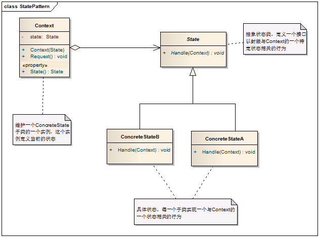
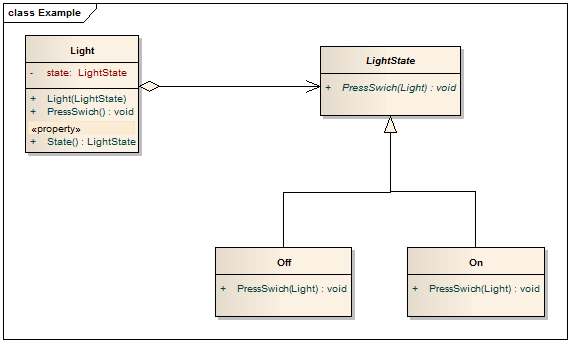

code reference
Java设计模式之深入理解状态模式
https://blog.csdn.net/shallynever/article/details/104483976/

模式中的角色

3.1 上下文环境（Context）：它定义了客户程序需要的接口并维护一个具体状态角色的实例，将与状态相关的操作委托给当前的Concrete State对象来处理。

3.2 抽象状态（State）：定义一个接口以封装使用上下文环境的的一个特定状态相关的行为。

3.3 具体状态（Concrete State）：实现抽象状态定义的接口。

4. 模式解读

4.1 状态模式的类图

模式总结

5.1 优点

5.1.1 状态模式将与特定状态相关的行为局部化，并且将不同状态的行为分割开来。

5.1.2 所有状态相关的代码都存在于某个ConcereteState中，所以通过定义新的子类很容易地增加新的状态和转换。

5.1.3 状态模式通过把各种状态转移逻辑分不到State的子类之间，来减少相互间的依赖。

5.2 缺点

5.2.1 导致较多的ConcreteState子类

5.3 适用场景

5.3.1 当一个对象的行为取决于它的状态，并且它必须在运行时刻根据状态改变它的行为时，就可以考虑使用状态模式来。

5.3.2 一个操作中含有庞大的分支结构，并且这些分支决定于对象的状态。

应用举例：电灯有两个状态，开（亮）与关（不亮），下面就用状态模式来实现对电灯的控制。

设计模式学习笔记-状态模式
https://www.cnblogs.com/wangjq/archive/2012/07/16/2593485.html

　　