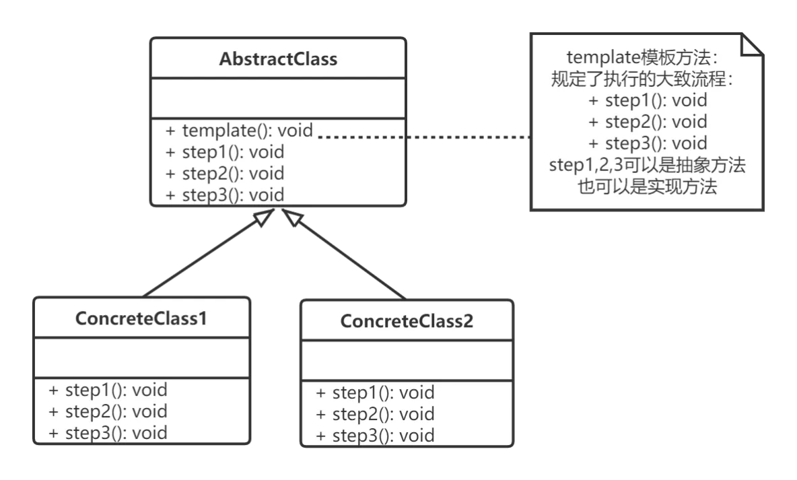
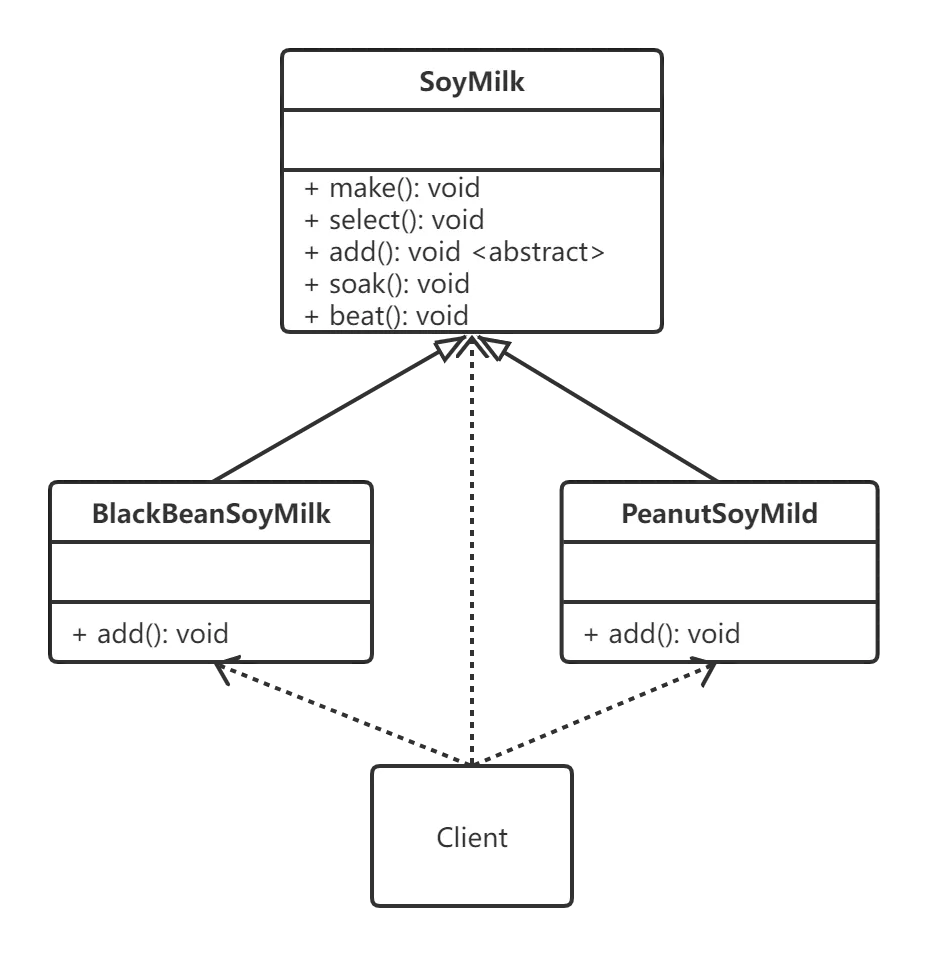

code reference
设计模式——模板方法模式
https://blog.51cto.com/learningfish/5406974

模板方法模式的结构
模板方法模式需要注意抽象类与具体子类之间的协作。
它用到了虚函数的多态性技术以及“不用调用我，让我来调用你”的反向控制技术。

1. 模板方法模式包含以下主要角色：

（1）抽象类/抽象模板（Abstract Class）

抽象模板类，负责给出一个算法的轮廓和骨架。
它由一个模板方法和若干个基本方法构成。这些方法的定义如下：

模板方法：定义了一套算法的骨架，按某种顺序调用其包含的基本方法。
基本方法：是算法骨架/流程的某些步骤进行具体实现，包含以下几种类型，
抽象方法：在抽象类中声明，由具体子类实现。
具体方法：在抽象类中已经实现，在具体子类中可以继承或重写它。
钩子方法：在抽象类中已经实现，包括用于判断的逻辑方法和需要子类重写的空方法两种。
（2）具体子类/具体实现（Concrete Class）

具体实现类，实现抽象类中所定义的抽象方法和钩子方法，它们是一个顶级逻辑的一个组成步骤。

2. 模板方法模式的结构图如下：(图来自网络)
 

实例结构图

3、优缺点
主要优点：

它封装了不变部分，扩展可变部分。它把认为是不变部分的算法封装到父类中实现，而把可变部分算法由子类继承实现，便于子类继续扩展。
将相同的部分代码提取到抽象父类中，可以提高代码的复用性。
部分方法是由子类实现的，因此子类可以通过扩展方式增加相应的功能，符合开闭原则。
主要缺点：

对每个不同的实现都需要定义一个子类，这会导致类的个数增加，系统更加庞大，设计也更加抽象，间接地增加了系统实现的复杂度。
父类中的抽象方法由子类实现，子类执行的结果会影响父类的结果，这导致一种反向的控制结构，它提高了代码阅读的难度。
由于继承关系自身的缺点，如果父类添加新的抽象方法，则所有子类都要改一遍。
————————————————
优点
模板方法模式通过把不变的行为搬移到超类，去除了子类中的重复代码。
子类实现算法的某些细节，有助于算法的扩展。
通过一个父类调用子类实现的操作，通过子类扩展增加新的行为，符合“开放-封闭原则”。

缺点
每个不同的实现都需要定义一个子类，这会导致类的个数的增加，设计更加抽象。

适用场景
在某些类的算法中，用了相同的方法，造成代码的重复。
控制子类扩展，子类必须遵守算法规则。

                            欢迎关注我的公众号“贞会说”

原文链接：https://blog.csdn.net/jason0539/article/details/45037535

                            版权声明：本文为博主原创文章，遵循 CC 4.0 BY-SA 版权协议，转载请附上原文出处链接和本声明。

原文链接：https://blog.csdn.net/qq_42402854/article/details/110917657