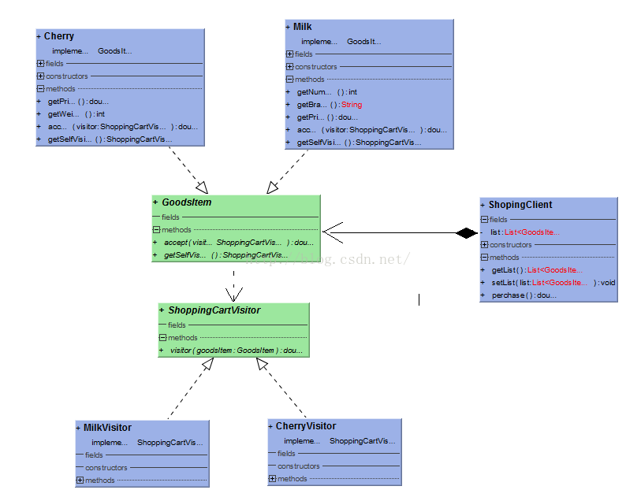
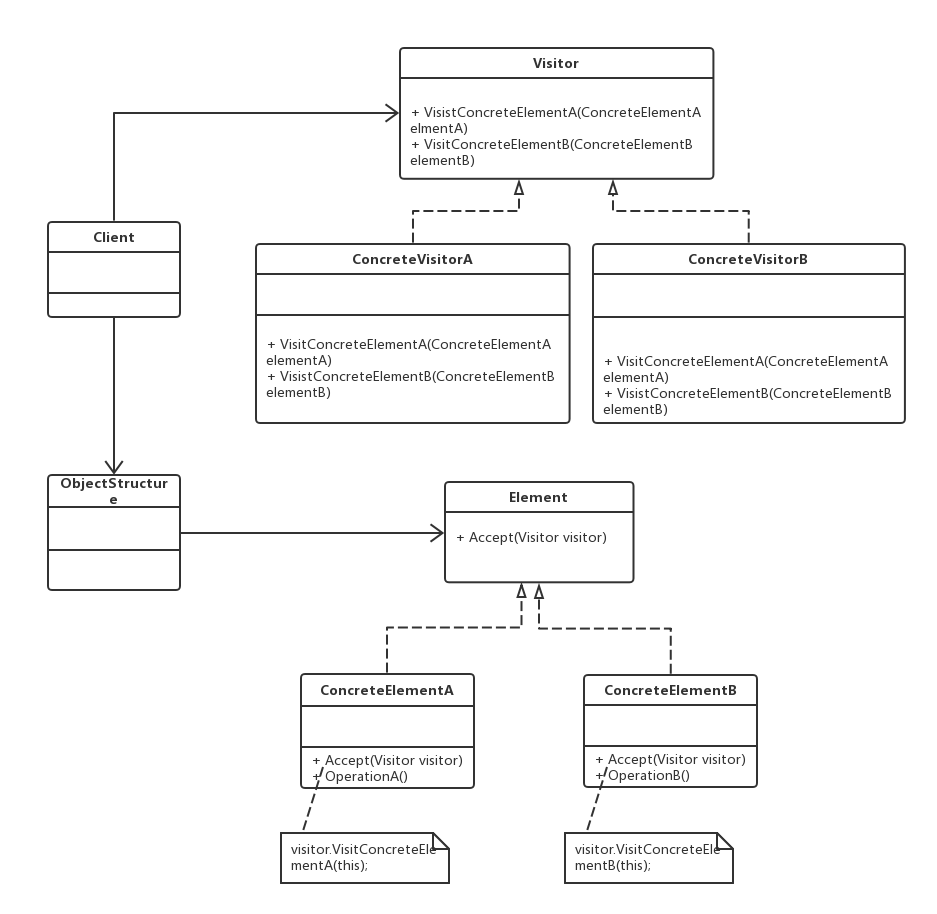
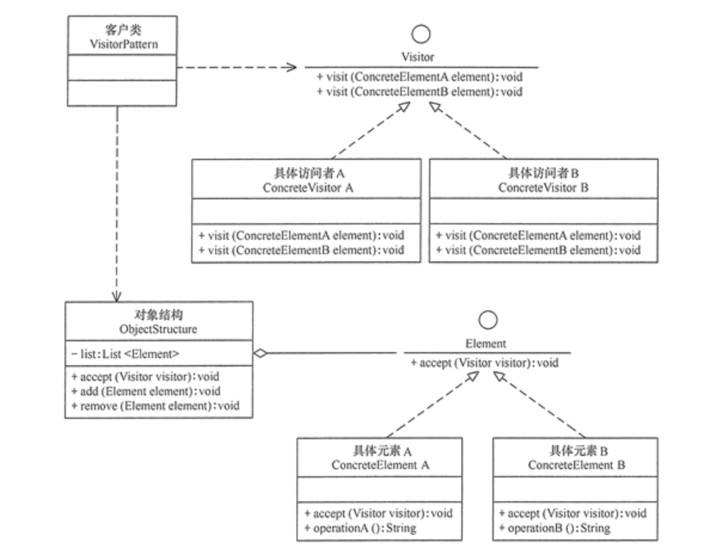

code reference
Java设计模式之--访问者模式（Visitor）
https://blog.csdn.net/lqh517/article/details/51751530

本文将展示如何利用访问者模式去实现电商购物车系统，平台上的商品的销售活动（操作行为）可能经常改变，但商品本身基本数据却相对稳定，这里就可以应用访问者模式，将行为与数据分离开来，达到解耦的目的。下面的例子并对访问者模式进行改进，让增加数据与改变操作行为一样方便。

先来看类图：

访问者模式是一种较为复杂的行为型模式，它包含访问者和被访问元素两个主要组成部分，这些被访问的元素通常具有不同的类型，且不同的访问者可以对它们进行不同的访问操作。例如：处方单中的各种药品信息就是被访问的元素，而划价人员和药房工作人员就是访问者。访问者模式可以使得用户在不修改现有系统的情况下扩展系统的功能，为这些不同类型的元素增加新的操作。

访问者（Visitor）模式：提供一个作用于某对象结构中的各元素的操作表示，它使得可以在不改变各元素的类的前提下定义作用于这些元素的新操作。访问者模式是一种对象行为型模式。

2.2 访问者模式结构

访问者模式结构图中包含以下5个角色：

（1）Visitor（抽象访问者）：抽象访问者为对象结构中每一个具体元素类ConcreteElement声明一个访问操作，从这个操作的名称或参数类型可以清楚知道需要访问的具体元素的类型，具体访问者则需要实现这些操作方法，定义对这些元素的访问操作。

（2）ConcreteVisitor（具体访问者）：具体访问者实现了抽象访问者声明的方法，每一个操作作用于访问对象结构中一种类型的元素。

（3）Element（抽象元素）：一般是一个抽象类或接口，定义一个Accept方法，该方法通常以一个抽象访问者作为参数。

（4）ConcreteElement（具体元素）：具体元素实现了Accept方法，在Accept方法中调用访问者的访问方法以便完成一个元素的操作。

（4）ObjectStructure（对象结构）：对象结构是一个元素的集合，用于存放元素对象，且提供便利其内部元素的方法。

访问者（Visitor）模式的定义：将作用于某种数据结构中的各元素的操作分离出来封装成独立的类，使其在不改变数据结构的前提下可以添加作用于这些元素的新的操作，为数据结构中的每个元素提供多种访问方式。它将对数据的操作与数据结构进行分离，是行为类模式中最复杂的一种模式。

二、访问者模式优缺点
　　访问者（Visitor）模式是一种对象行为型模式，其主要优点如下：

扩展性好。能够在不修改对象结构中的元素的情况下，为对象结构中的元素添加新的功能。
复用性好。可以通过访问者来定义整个对象结构通用的功能，从而提高系统的复用程度。
灵活性好。访问者模式将数据结构与作用于结构上的操作解耦，使得操作集合可相对自由地演化而不影响系统的数据结构。
符合单一职责原则。访问者模式把相关的行为封装在一起，构成一个访问者，使每一个访问者的功能都比较单一。
　　访问者（Visitor）模式的主要缺点如下：

增加新的元素类很困难。在访问者模式中，每增加一个新的元素类，都要在每一个具体访问者类中增加相应的具体操作，这违背了“开闭原则”。
破坏封装。访问者模式中具体元素对访问者公布细节，这破坏了对象的封装性。
违反了依赖倒置原则。访问者模式依赖了具体类，而没有依赖抽象类。
三、访问者模式的实现
　　访问者（Visitor）模式实现的关键是如何将作用于元素的操作分离出来封装成独立的类，访问者模式包含以下主要角色：

抽象访问者（Visitor）角色：定义一个访问具体元素的接口，为每个具体元素类对应一个访问操作 visit() ，该操作中的参数类型标识了被访问的具体元素。
具体访问者（ConcreteVisitor）角色：实现抽象访问者角色中声明的各个访问操作，确定访问者访问一个元素时该做什么。
抽象元素（Element）角色：声明一个包含接受操作 accept() 的接口，被接受的访问者对象作为 accept() 方法的参数。
具体元素（ConcreteElement）角色：实现抽象元素角色提供的 accept() 操作，其方法体通常都是 visitor.visit(this) ，另外具体元素中可能还包含本身业务逻辑的相关操作。
对象结构（Object Structure）角色：是一个包含元素角色的容器，提供让访问者对象遍历容器中的所有元素的方法，通常由 List、Set、Map 等聚合类实现。
　　其结构图如图所示：

https://www.cnblogs.com/jing99/p/12617288.html　　　　　　　　　　

3、访问者模式的优缺点
优点：
符合单一职责原则，即数据的存储和操作分别由对象结构类和访问者类实现。
优秀的扩展性和灵活性。
缺点：
具体元素对访问者公布了其细节，违反了迪米特法则。
具体元素的增加将导致访问者类的修改，违反了开闭原则。
访问者类依赖了具体类而不是抽象，违反了依赖倒置原则。
4、访问者模式的使用场景
当对象结构相对稳定，但其操作算法经常变化时。
当需要为对象结构中的元素提供多个不同且不想管的操作，且要避免让这些操作的变化影响对象的结构时。
————————————————

                            版权声明：本文为博主原创文章，遵循 CC 4.0 BY-SA 版权协议，转载请附上原文出处链接和本声明。

原文链接：https://blog.csdn.net/XGLLHZ/article/details/128406980

